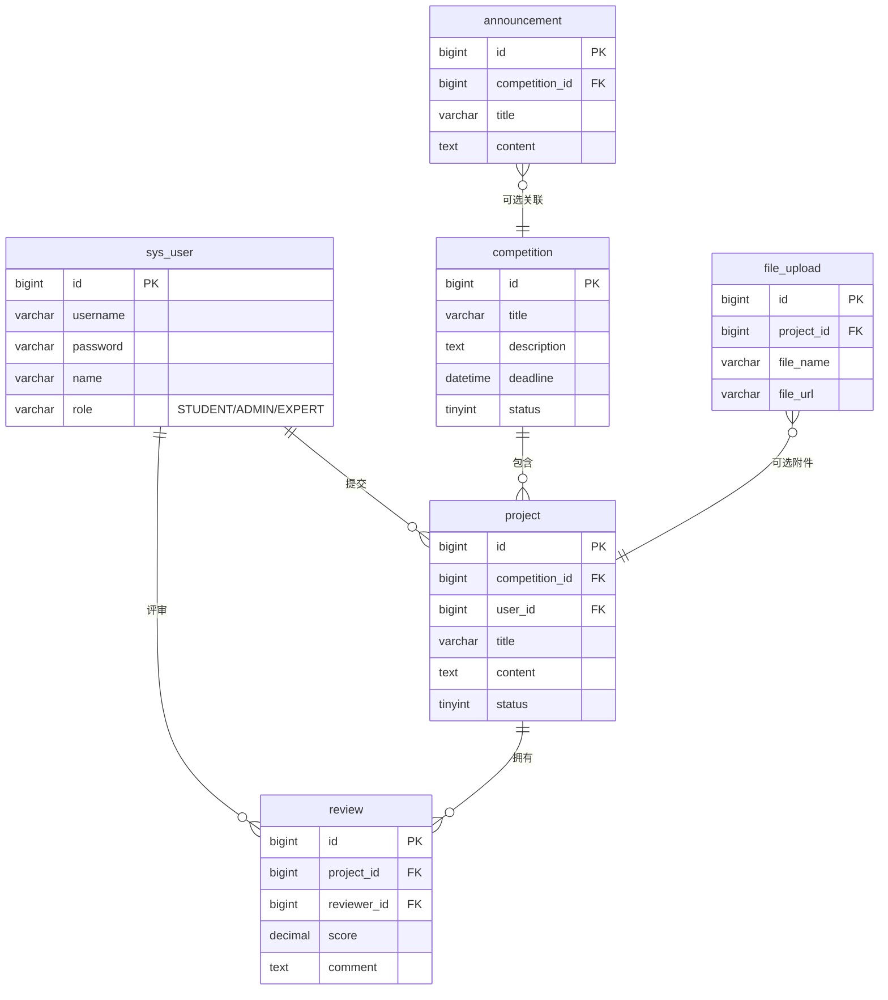

# 大学生创新创业大赛平台

> 集**后端 API + 管理后台 + 学生微信小程序** 三位一体的竞赛管理解决方案

[](https://spring.io/projects/spring-boot)
[](https://baomidou.com/)
[](https://vuejs.org/)
[](https://www.java.com/)
[](https://www.mysql.com/)
[](LICENSE)

---

## 📖 项目简介

本平台面向高校「互联网+」、「挑战杯」等创新创业赛事场景，提供从**赛事发布 → 项目申报 → 专家评审 → 结果公示**的全流程数字化管理能力。

## ✨ 核心功能

| 角色 | 功能 |
|------|------|
| 👨‍🎓 **学生** | 注册登录（账号密码 / 微信授权）、浏览赛事、在线报名、提交项目、查看评审结果 |
| 👨‍💼 **管理员** | 用户管理、赛事 CRUD、公告发布、项目总览、评审分配、数据统计仪表盘 |
| 🧑‍🏫 **评审专家** | 待评审项目列表、在线打分、撰写评语、查看评审历史 |

## 🏗️ 技术架构

```
┌─────────────────┐     ┌──────────────────┐     ┌──────────────┐
│  微信小程序      │     │  Vue3 管理后台    │     │  Postman/CLI │
│  (学生端)        │     │  (管理员/专家端)  │     │  (接口调试)  │
└────────┬────────┘     └────────┬─────────┘     └──────┬───────┘
         │    HTTPS / JWT Bearer                          │
         └───────────────┬────────────────────────────────┘
                         ▼
              ┌───────────────────┐
              │  SpringBoot 3.2.5  │
              │  RESTful API       │
              │  JWT 拦截器鉴权     │
              └─────────┬─────────┘
                        ▼
              ┌───────────────────┐
              │  MySQL 8.0         │
              │  Redis（可选）      │
              └───────────────────┘
```

### 技术栈一览

| 层级 | 技术 |
|------|------|
| **后端** | SpringBoot 3.2.5 · MyBatis-Plus 3.5.5 · jjwt 0.12.6 · Validation |
| **数据库** | MySQL 8.0 · Redis（会话缓存，可选） |
| **管理后台** | Vue 3 · Vite 5 · Element Plus · Pinia · Vue Router 4 · ECharts |
| **学生端** | 微信原生小程序（WXML / WXSS / JavaScript） |
| **构建工具** | Maven 3.8+ · Node.js 18+ |

## 📂 目录结构

```
innovation-competition-platform/
├── backend/                # SpringBoot 后端
│   ├── src/main/java/com/competition/platform/
│   │   ├── common/         # 全局异常处理、统一响应 R<T>
│   │   ├── config/         # MyBatisPlus / CORS / JWT 拦截器配置
│   │   ├── controller/     # 8 个 REST Controller
│   │   ├── entity/         # 6 个数据库实体
│   │   ├── interceptor/    # JwtInterceptor
│   │   ├── mapper/         # MyBatis-Plus Mapper
│   │   ├── service/        # 业务逻辑层
│   │   └── util/           # JwtUtil 工具类
│   ├── sql/init.sql        # 数据库初始化脚本
│   └── pom.xml
├── admin-web/              # Vue3 管理后台
│   ├── src/
│   │   ├── api/            # 按模块拆分的 axios 请求
│   │   ├── views/          # Dashboard / Login / 6 个业务页面
│   │   ├── router/         # Vue Router
│   │   └── stores/         # Pinia user store
│   ├── vite.config.js
│   └── package.json
├── miniapp/                # 微信原生小程序（学生端）
│   ├── pages/              # 8 个页面（登录/首页/赛事/项目/评审结果/我的…）
│   ├── utils/              # request.js 封装 / auth.js 登录态
│   ├── app.js / app.json / app.wxss
│   └── project.config.json
├── .gitignore
└── README.md
```

## 🚀 快速开始

### 1. 环境准备

- JDK 17+
- Node.js 18+
- MySQL 8.0
- Maven 3.8+
- 微信开发者工具（运行小程序）

### 2. 初始化数据库

```bash
# 登录 MySQL
mysql -u root -p

# 创建数据库并执行初始化脚本
SOURCE backend/sql/init.sql;
```

> 默认建库名 `innovation_platform`，6 张表：`sys_user` · `competition` · `project` · `review` · `announcement` · `file_upload`

### 3. 启动后端

```bash
cd backend

# 修改 application.yml 中的数据库账号密码
# 默认配置：root / 123456，端口 8090

mvn spring-boot:run
```

服务启动后访问 `http://localhost:8090/api/auth/login` 进行登录测试。

**默认账号（init.sql 内置）**

| 角色 | 用户名 | 密码 |
|------|--------|------|
| 管理员 | `admin` | `admin123` |
| 学生 | `student1` | `student123` |
| 专家 | `expert1` | `expert123` |

### 4. 启动管理后台

```bash
cd admin-web
npm install
npm run dev
```

浏览器访问 `http://localhost:5180`，使用管理员账号登录。

### 5. 运行学生小程序

1. 打开**微信开发者工具**，选择「导入项目」
2. 项目目录选 `miniapp/`
3. AppID 使用测试号（或填写自己的小程序 AppID，需要在 `project.config.json` 和后端 `application.yml` 同步修改）
4. 本地设置勾选「不校验合法域名」，直接预览

## 🔐 鉴权机制

项目基于 **JWT（jjwt 0.12.6）** 实现无状态鉴权：

```
客户端                              服务端
  │  POST /api/auth/login              │
  │  { username, password }            │
  │ ─────────────────────────────────> │
  │                                    │  验证账号密码
  │                                    │  签发 JWT（24h 有效）
  │  { token, user }                   │
  │ <───────────────────────────────── │
  │                                    │
  │  GET /api/project/my               │
  │  Authorization: Bearer <token>    │
  │ ─────────────────────────────────> │
  │                                    │  JwtInterceptor 解析
  │                                    │  注入 userId / role
  │  { code:200, data: [...] }         │
  │ <───────────────────────────────── │
```

角色权限通过 JWT payload 中的 `role` 字段识别（`STUDENT` / `ADMIN` / `EXPERT`），在 Controller 层按需校验。

## 📡 API 概览

基础路径：`/api` | 鉴权：`Authorization: Bearer <token>`

| 模块 | 方法 | 路径 | 说明 | 需鉴权 |
|------|------|------|------|--------|
| 认证 | POST | `/auth/login` | 账号密码登录 | ❌ |
| 认证 | POST | `/auth/wx-login` | 微信 code 登录 | ❌ |
| 认证 | GET | `/auth/me` | 获取当前用户信息 | ✅ |
| 赛事 | GET | `/competition/list` | 赛事列表 | ❌ |
| 赛事 | POST | `/competition` | 新建赛事 | ✅ 管理员 |
| 项目 | POST | `/project/submit` | 提交项目 | ✅ 学生 |
| 评审 | POST | `/review/submit` | 提交评审 | ✅ 专家 |
| 用户 | GET | `/user/list` | 用户列表 | ✅ 管理员 |
| 文件 | POST | `/file/upload` | 文件上传（≤20MB） | ✅ |

## 🗄️ 数据模型



## 📝 许可证

本项目基于 [MIT License](LICENSE) 开源。

## 👤 贡献者

| 姓名 | 角色 |
|------|------|
| 杨欣宇 | 项目发起人 |

PR 欢迎 🎉

---

## 安全与部署

本仓库已落实以下生产就绪与安全加固（密钥均已外置到环境变量，见 `backend/.env.example`）：

- **密钥外置**：`DB_PASSWORD`、`JWT_SECRET`、`WX_SECRET` 等均通过环境变量注入，禁止硬编码。生产务必覆盖 `JWT_SECRET`。
- **接口鉴权修复**：`WebMvcConfig` 修正了 `/api/auth/logout` 漏写前导 `/` 的放行 bug；移除了 `/api/debug/**` 的放行（原为调试后门）；并将 `/files/**` 纳入 JWT 拦截范围，文件下载需携带有效 Bearer Token。
- **越权修复**：`PUT /api/user` 仅允许本人或管理员修改；`PUT /api/user/{id}/reset-password` 仅管理员可执行（返回 403）。`update` 已清空 `role/username/password` 字段，杜绝提权。
- **文件安全**：上传扩展名白名单限制（拒绝可执行/危险类型）；上传目录可通过 `UPLOAD_DIR` 配置（默认 `./uploads/competition`）；文件元数据与上传结果均不向客户端泄露服务器本地磁盘路径（`filePath` 置空）。
- **Actuator 健康端点**：引入 `spring-boot-starter-actuator`，仅暴露 `health`、`info`；`health` 详细信息 `show-details: when_authorized`。
- **CORS 必须配置**：生产环境请设置环境变量 `CORS_ALLOWED_ORIGINS`（逗号分隔的允许来源）。`CorsConfig` 默认仅放开本地前端来源。
- **不回显内部异常**：全局异常处理器对未捕获 `RuntimeException` 统一返回「服务器内部错误」，完整堆栈仅记录在服务端日志。
- **结构化日志**：`backend/src/main/resources/logback-spring.xml` 输出控制台 + 滚动文件，应用包 `INFO`、MyBatis/SQL 日志降为 `WARN`（已关闭 `StdOutImpl`，避免完整 SQL 与参数打印到 stdout）。
- **CI**：`.github/workflows/ci.yml` 使用 JDK 17 + `mvn -B test` 进行构建与测试。
